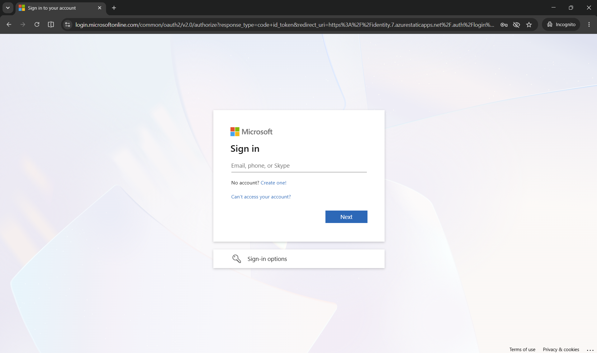
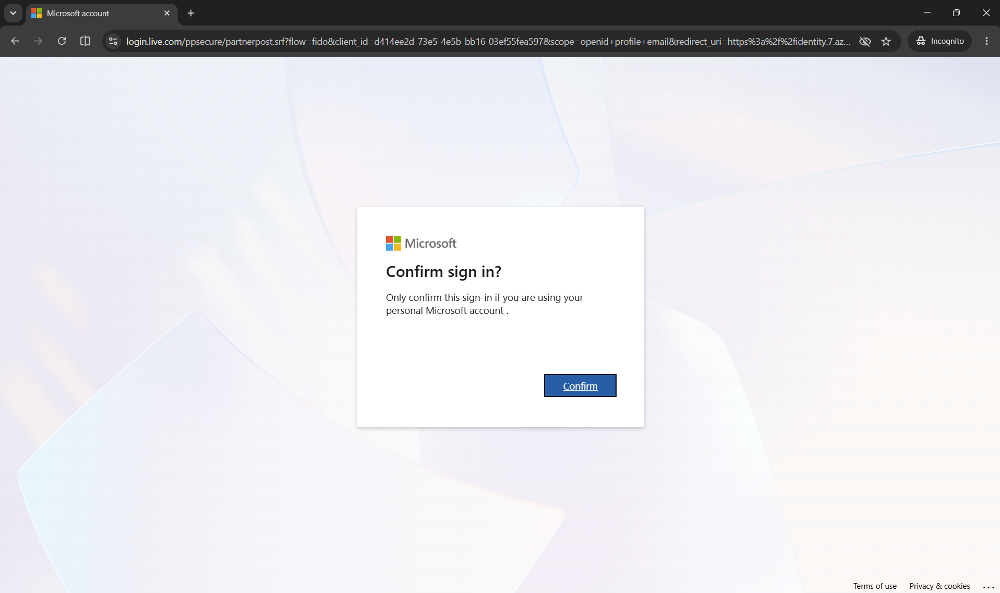
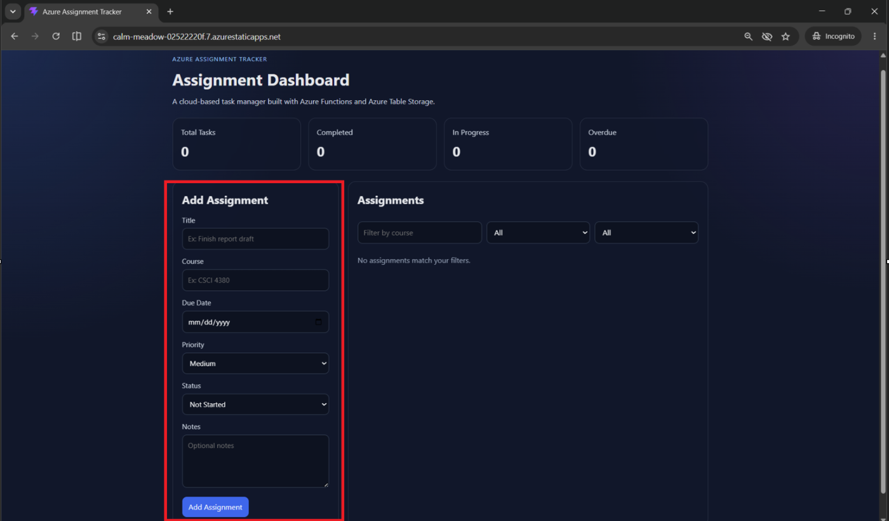
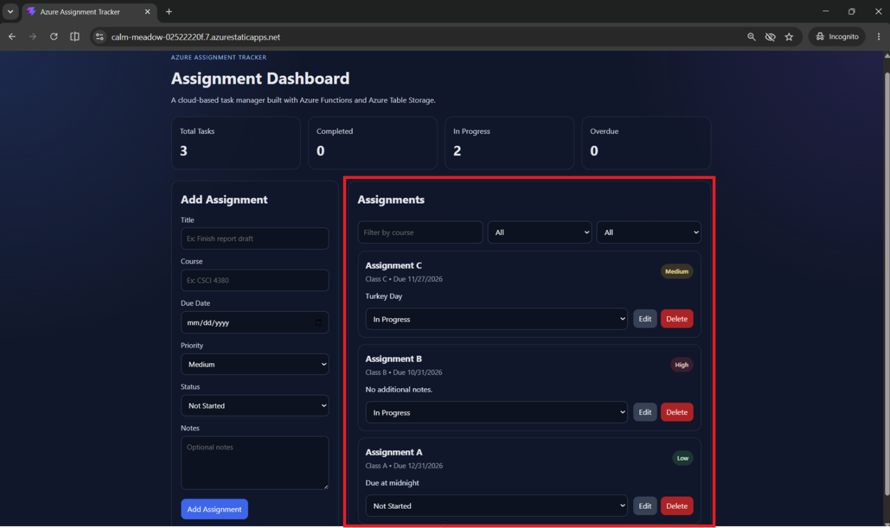
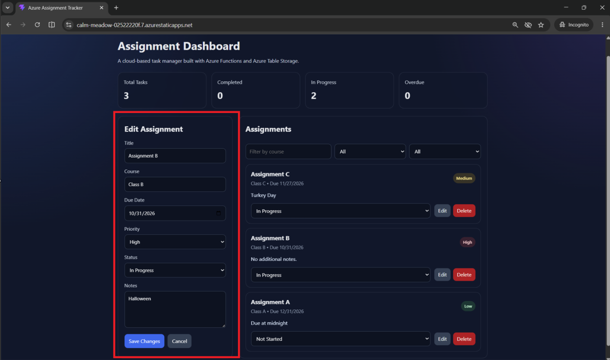

# Azure Assignment Tracker
A cloud-based assignment management app built with React, Azure Static Web Apps, Azure Functions, and Azure Table Storage.

## The Azure Assignment Tracker helps students organize coursework in one place by allowing them to:
- Create and manage assignments
- Track progress from Not Started -> In Progress -> Done
- Organize assignments by course
- Set priorities and due dates
- Store assignments securely in the cloud
- Keep every user's assignments private through Microsoft authentication

## First-Time User Guide
Step 1 – Open the application through the link in the about section on GitHub. 



Step 2 – Sign in with your personal Microsoft account



- Your account is only used to identify you.
- Each authenticated user has their own isolated assignment storage.

Step 3 - Create your first assignment



Step 4 - Manage assignments



- Edit: Click this to change any aspect of the assignment that has changed. 
- Delete: Click this to delete any assignments that are outdated or unnecessary.  
- Status Dropdown: Click this to update the status of the assignment between 3 options: Done, In Progress, Not Started. 
- Priority Badges: Indicates the importance/urgency level of each assignment.

Step 4.5 - Editing Assignments

After clicking edit, the add assignment section will convert to the edit section. 



Step 5 - Filtering Assignments

There are three options to filter assignments by: Course, Progress, Priority.

- Filter by course name:


- Filter by progress:


- Filter by Priority:


Step 6 – Get to Work...

## Privacy
The Azure Assignment Tracker uses **Microsoft Authentication** to provide each user with a secure, personalized experience.

After signing in, every user is assigned a unique storage partition in Azure Table Storage. All assignment data is isolated by user, ensuring that:

- Your assignments are private and cannot be viewed by other users.
- All create, read, update, and delete (CRUD) operations are performed only on your own data.
- Authentication is required before accessing assignment information.

## Technologies Used

### Frontend
- React
- JavaScript (ES6+)
- HTML5
- CSS3

### Backend
- Azure Functions
- Node.js
- RESTful API

### Cloud Services
- Azure Static Web Apps
- Azure Table Storage
- Microsoft Authentication (Azure Static Web Apps Authentication)

## Architecture

The application follows a serverless architecture hosted on Microsoft Azure.

```
React Frontend
        │
        ▼
Azure Static Web Apps
        │
        ▼
Azure Functions REST API
        │
        ▼
Azure Table Storage
        │
        ▼
User-specific data partitioning based on Microsoft Authentication
```

Each authenticated user interacts only with their own assignments, providing secure and isolated cloud storage.

